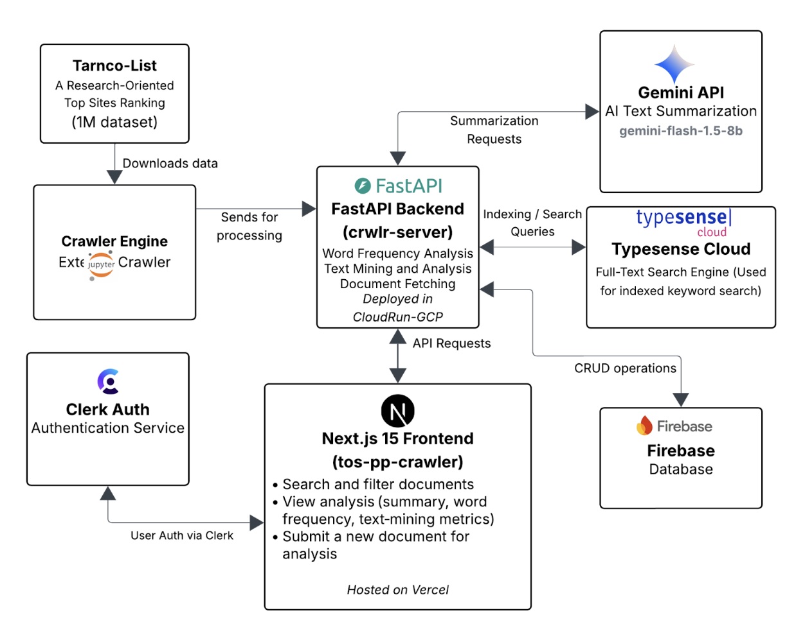

# tos-pp-crawler

A Next.js 15 (App Router) application that allows users to submit website URLs for analysis of Terms of Service (ToS) and Privacy Policy (PP) documents. It features user authentication, duplicate detection, pagination, filtering, admin panel, and integration with a backend API.

## Project Architecture



## Repositories

- Frontend: https://github.com/rohithgoud30/tos-pp-crawler
- Backend: https://github.com/rohithgoud30/crwlr-server
- Crawler Engine: https://github.com/rohithgoud30/crawlr-engine

## Live Links

- Frontend (Production): https://tos-pp-crawler.vercel.app/
- Backend API (Google Cloud Run): https://crwlr-server-662250507742.us-east4.run.app/

## Quick Start

```bash
# 1. Clone the repository
git clone https://github.com/rohithgoud30/tos-pp-crawler.git
cd tos-pp-crawler

# 2. Install dependencies
npm install
# or
# yarn install

# 3. Create .env.local in the project root and paste in:
cat <<EOF > .env.local
# API Configuration
NEXT_PUBLIC_BACKEND_URL=https://crwlr-server-662250507742.us-east4.run.app
NEXT_PUBLIC_API_KEY=6e878bf1-c92d-4ba1-99c9-50e3343efd5d

# Clerk Configuration
NEXT_PUBLIC_CLERK_PUBLISHABLE_KEY=pk_test_cHJvZm91bmQtZWVsLTk5LmNsZXJrLmFjY291bnRzLmRldiQ
CLERK_SECRET_KEY=sk_test_62QwySSMQJJYmt0dNTKYW7SXrMf8GdpSn492MqTFR0

# Clerk Redirect URLs
NEXT_PUBLIC_CLERK_SIGN_IN_URL=/auth/login
NEXT_PUBLIC_CLERK_SIGN_UP_URL=/auth/signup
NEXT_PUBLIC_CLERK_AFTER_SIGN_IN_URL=/
NEXT_PUBLIC_CLERK_AFTER_SIGN_UP_URL=/
EOF

# 4. Start development server
npm run dev
# or
# yarn dev
```

## Features

- User authentication with Clerk.
- Submit URLs for analysis of ToS and PP documents.
- Duplicate detection to avoid reprocessing the same domain.
- View analysis results and detailed error messages.
- Retry failed submissions with custom document URLs.
- Admin panel for searching and filtering all users' submissions.
- Pagination, sorting (asc/desc), and filters (document type, status, date).
- Responsive UI built with Tailwind CSS and Lucide icons.
- Toast notifications and dialogs for smooth UX.

## Tech Stack

- Next.js 15 (App Router)
- React & TypeScript
- Tailwind CSS
- Clerk for authentication
- Lucide React icons
- SWR/React Query for data fetching via custom hooks (`useSubmissionsList`, `useSubmissionSearch`)
- Vercel for deployment

## Prerequisites

- Node.js 16 or later
- npm or Yarn package manager

## Build & Production

- Build the application:

  ```bash
  npm run build
  # or
  yarn build
  ```

- Start in production mode:

  ```bash
  npm start
  # or
  yarn start
  ```

## Deploy

This app is ready for deployment on [Vercel](https://vercel.com). You can also deploy to other platforms that support Node.js:

1. Push your code to GitHub.
2. Import the repo into Vercel.
3. Configure environment variables on the Vercel dashboard.
4. Trigger a deployment via Vercel.

## File Structure

```
.
├── src
│   ├── app           # Next.js App Router pages (submissions, analysis, auth, etc.)
│   ├── components    # Reusable UI components (buttons, inputs, dialogs)
│   ├── context       # React context providers (e.g. auth, toasts)
│   ├── hooks         # Custom React hooks for data fetching and caching
│   └── lib           # API client functions for submissions and admin endpoints
├── public            # Static assets and images
├── scripts           # Utility scripts (e.g. code generation)
├── .env.local        # Environment variables (not checked into VCS)
├── next.config.js    # Next.js configuration
├── tailwind.config.js# Tailwind CSS configuration
├── tsconfig.json     # TypeScript configuration
└── README.md         # Project overview and setup instructions
```

## Contributing

Contributions are welcome! Please open issues or pull requests to improve the project.

## License

This project is MIT licensed.
